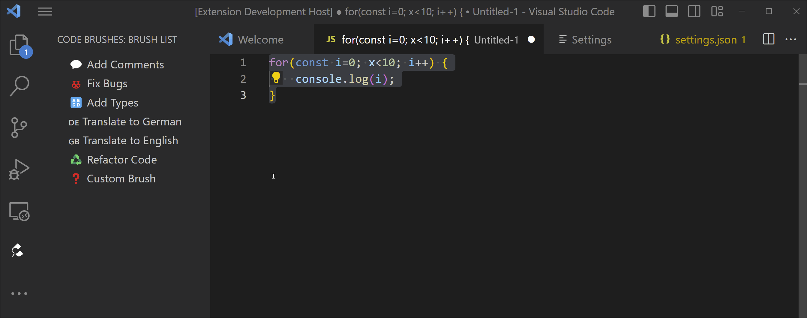

# GPT-4 Brushes

GPT-4 Brushes is a Visual Studio Code extension that allows you to apply custom "brushes" to selected code in the editor using OpenAI's GPT-4 Completion API. It provides a set of predefined "brushes", but the main feature is the ability to define custom brushes for your use cases. The extension works similarly to the brushes in the Copilot Lab Extension, but with some important differences to improve usability (see features below).



## Features

- Define your own brushes in the settings file
- Uses the newest Chat API using GPT-4
- Replaces selected text in the editor directly instead of requiring copy & paste
- Custom brushes can include variables that the user has to enter when activating the brush
- NEW! Ability to override baseUrl to be used with OpenAI requests (for proxies, etc.)
- NEW! Experimental support for other code brush providers such as javascript functions

## Prerequisites

- An OpenAI API key. Create an API key on the [OpenAI website](https://platform.openai.com/account/api-keys).
- Access to GPT-4 model via API

## Disclaimers
- I'm not responsible for any undesired code changes or other side effects caused by the extension. Use at your own risk and make sure to use source control.
- Be aware that the extension needs to send your selection to the OpenAI API in order for the extension to work. Check the OpenAI Terms of Service for more information on how OpenAI processes or stores information submitted via API.
- OpenAI charges a small fee for each token submitted and received from the API. The number of tokens used depends on the length of the selected text and the prompt. You can use the [OpenAI API Explorer](https://beta.openai.com/api-explorer) to get an idea of the number of tokens used for different requests.

## Configuration
To configure brushes, add a 'gptbrushes.brushes' section to your Visual Studio Code settings. Each brush should have a name, icon, and prompt.

Here is an example configuration:
```
"gptbrushes.brushes": [
  {
    "name": "Add comments",
    "icon": "💬",
    "prompt": "Add code comments to the code send to the user."
  }
]
```

The prompt will be used as the system message in the Chat API. The code selected in the editor will be sent as the user message. Any response returned by the assistant will replace the selected text in the editor.

You can ask for additional input from the user using variables:

```
{
    "name": "Translate",
    "icon": "🌐",
    "prompt": "Translate the text from the user to {{prompt}}",
    "variables": [
        {
            "name": "prompt",
            "defaultValue": "English",
            "description": "Please enter target language."
        }
    ]
}
```

There is also experimental support for Javascript-based brushes:
```
{
    "name": "Uppercase",
    "icon": "⬆️",
    "type": "javascript",
    "prompt": "(input) => input.toUpperCase();",
}
```

Alternatively, you can configure javascript brushes by adding javascript (.js) files into your workspace folder in the .vscode/codebrushes folder. The name of the javascript file will be used as the name of the brush. The javascript file has to contain the function directly (i.e. not exported). Example content:
```
(input) => input.toUpperCase();
```

## Usage

1. Click on the GPT-4 Brushes icon in the Activity Bar to see the list of available brushes.
2. Select the text you want to modify in the Visual Studio Code editor.
3. Click on a brush from the list. The extension will send a request to the API with the selected text and the configured prompt.
4. The selected text will be replaced with the completion generated by the API.

Be aware that GPT-4 is relatively slow and the extension needs to wait for the API response before replacing the selected text. You should start using small selections to get a feel for the speed of completions. If you want to cancel the request, you can click on the progress indicator in the status bar.

## Contributing
Feel free to submit issues or pull requests on the GitHub repository.

## License
MIT